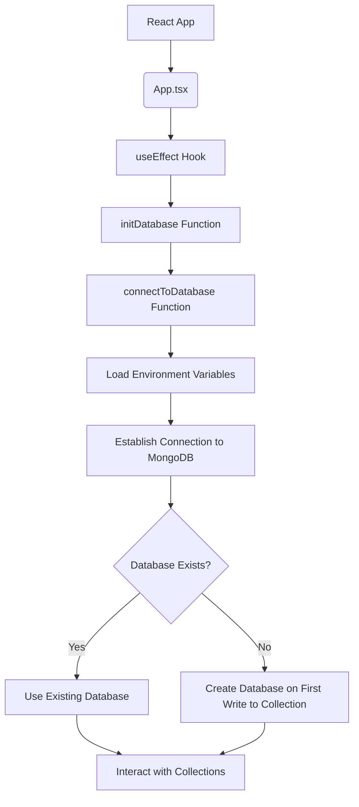

Create MongoDB Database in a React Admin App with TypeScript
============================================================

This tutorial will guide you through the process of checking if a MongoDB database exists, and creating one if it doesn't in a React Admin app using TypeScript. We will use `mongoose` as the MongoDB driver for connecting to the database.

Prerequisites
-------------

*   Basic knowledge of React, TypeScript, and MongoDB.
*   Node.js and npm installed on your system.
*   A running MongoDB instance (local or remote).

Step 1: Set up a new React project with TypeScript
--------------------------------------------------

1.  Create a new React project using `create-react-app` with the TypeScript template:

```sh
npx create-react-app my-react-admin --template typescript
```

2.  Change into the new project directory:

```sh
cd my-react-admin
```

Step 2: Install necessary packages
----------------------------------

1.  Install `mongoose` and its TypeScript typings:

```sh
npm install mongoose
npm install --save-dev @types/mongoose
```

2.  Install `dotenv` and its TypeScript typings to manage environment variables:

```sh
npm install dotenv
npm install --save-dev @types/dotenv
```

Step 3: Configure environment variables
---------------------------------------

1.  Create a `.env` file in the root of your project:

```sh
touch .env
```

2.  Add your MongoDB connection string to the `.env` file:

```ini
MONGODB_URI=mongodb://localhost:27017/my_database
```

Replace `my_database` with your desired database name.

Step 4: Create a database connection module
-------------------------------------------

1.  Create a new folder named `database` in the `src` directory:

```sh
mkdir src/database
```

2.  Create a `connection.ts` file in the `src/database` folder:

```sh
touch src/database/connection.ts
```

3.  Add the following code to `connection.ts`:

```typescript
import mongoose from "mongoose";
import dotenv from "dotenv";

dotenv.config();

const connectToDatabase = async () => {
  try {
    const connection = await mongoose.connect(process.env.MONGODB_URI!, {
      useNewUrlParser: true,
      useUnifiedTopology: true,
    });

    console.log("Connected to MongoDB!");
    return connection;
  } catch (error) {
    console.error("Error connecting to MongoDB:", error);
    throw error;
  }
};

export default connectToDatabase;
```

This module exports a function that connects to the MongoDB instance specified in the `.env` file.

Step 5: Check for and create the database in your app
-----------------------------------------------------

1.  Open the `src/App.tsx` file and import the `connectToDatabase` function:

```typescript
import connectToDatabase from "./database/connection";
```

2.  Call the `connectToDatabase` function in a `useEffect` hook:

```typescript
import React, { useEffect } from "react";

useEffect(() => {
  const initDatabase = async () => {
    await connectToDatabase();
  };

  initDatabase();
}, []);
```

This will establish a connection to the MongoDB instance when your app loads.

When connecting to MongoDB using `mongoose`, if the specified database does not exist, it will be automatically created when data is written to a collection for the first time.

Step 6: Run your app
--------------------

1.  Start your React app:

```sh
npm start
```

Now, your app will check for the existence of the specified MongoDB database and create it if it doesn't exist.

You can continue building your admin form and use `mongoose` to interact with your MongoDB collections. When you start writing data to your collections, the database will be created automatically if it doesn't exist.
